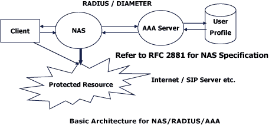

# Computer Network -AAA

## Explain each of the three A’s as you would to a non-technical family member. Use an analogy or a story.

Authentication is a process that verifys a user. For example your username and password for your phone or computer. It purpose to ensure only authorized users can see the data
Authorization is the level of access a user has. Like if someone has access to look at your photos on facebook but not edit or delete them.
Accounting which is the process of tracking and recording what actions are taken within in a system. It allows a company to monitor and detect unauthorized access or suspicious activity

## What should the administrator do if the ACS server fails to authenticate a user during AAA implementation?
>  If the ACS server fails to authenticate, the administrator should mention using the local database of the device as a backup, in the method list, to implement AAA.

## What is the role of the NAS in the AAA implementation using an ACS server? Use a diagram.

# RADIUS Concepts

## What are the benefits of using RADIUS for authentication and authorization?
RADIUS is a widely used protocol and is supported by many networking devices and software implementations. It provides a centralized and standardized method for managing user access and can be used with a wide range of authentication sources and access policies.

## What is RADIUS and what does it stand for?
RADIUS (Remote Authentication Dial-In User Service) networking protocol used for centralized authentication, authorization, and accounting (AAA) management for users who connect to and use network resources such as routers, switches, and servers.

## Research: What encryption algorithms does RADIUS use?
> RADIUS itself does not specify any encryption algorithms, as it is a protocol used for authentication, authorization, and accounting (AAA) purposes. However, when RADIUS messages are transmitted over the network, it is recommended that they are encrypted to ensure security and protect against unauthorized access. -CHATGBT

## I'm not the link is right
It did not seem very helpful to answer the questions